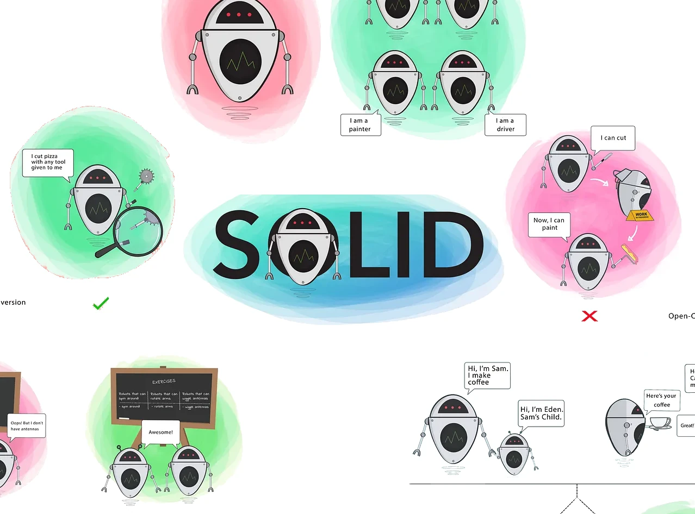
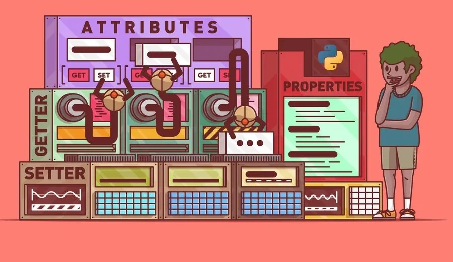

# Sobre

## Seção: `Introdução à Orientação a Objetos (POO) e SOLID`

- Apresentando um paradigma que é a base para inúmeras arquiteturas, POO, Programação orientada a objetos, onde foi mostrado como implementar usando o typescript, por meio de classes, detalhando seus pilares, abstração, encapsulamento, herança e poliformismo.
- Seguindo com a introdução aos princípios SOLID:
- `S`ingle Responsability
- `O`pen/Closed
- `L`iskov Substitution
- `I`nterface segregation
- `D`ependency Inversion
#

  

>*lore*
#
## Projeto: `Trybers and Dragons`

- Atividade para por em prática a criação de classes usando o paradigma de orientação a objeto seguindo alguns princípios SOLID, de um jogo de fantasia, onde existem raças, arquetipos, personagens, monstros com caracteristicas exclusivas e compartilhadas, e combate baseado em PVE e PVP.

# Tecnologias e ferramentas usadas 🛠

# Desafios

- Criar classes usando dos pilares de POO.
- Criar interfaces
- Implementar em Typescript, classes, Instâncias, atributos, métodos e objetos.
- Aplicar princípios SOLID.

# Conclusão

- Por ter um certo amor por jogos, a implementação da trybe foi muito emocionante durante todo desenvolvimento do readme deles, com toda uma Lore, criando uma atmosfera de jogo, onde eu ia criando cada personagem/npc como se fosse um jogo, foi muito divertido, a criação e implementação de cada funcionalidade de objeto com suas caracteristicas. Maior dificuldade inicial era entender a sintaxe e usabilidade das classes mais a tipagem do typescript também com relação ao POO, ja SOLID, é algo que eu preciso praticar mais no dia-a-dia, para consolidar melhor.

  

    <strong>
      :newspaper_roll: Requisitos solicitados durante o desenvolvimento do projeto
    </strong>
  

 
### Requisitos
*Nome* | *Avaliação*
--- | :---:
01 - Classe Race | :heavy_check_mark:
02 - Classes que herdam de Race | :heavy_check_mark:
03 - Energy | :heavy_check_mark:
04 - Classe Archetype | :heavy_check_mark:
05 - Classes que herdam de Archetype | :heavy_check_mark:
06 - Interface Fighter | :heavy_check_mark:
07 - Classe Character | :heavy_check_mark:
08 - Interface SimpleFighter | :heavy_check_mark:
09 - Classe Monster | :heavy_check_mark:
10 - Classe PVP | :heavy_check_mark:
11 - Classe PVE | :heavy_check_mark:
12 - Classe Dragon | :heavy_check_mark:
13 - Arquivo index | :heavy_check_mark:

  

    <strong>
      :memo: Todo list
    </strong>
  

  - [x] - ~~Criar aplicação com base nos requisitos da trybe.~~ 

#

  

